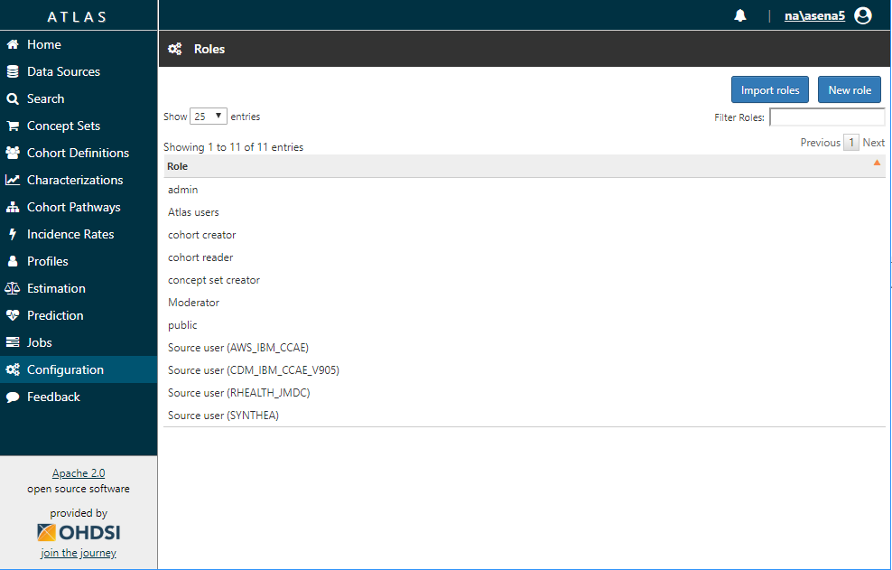
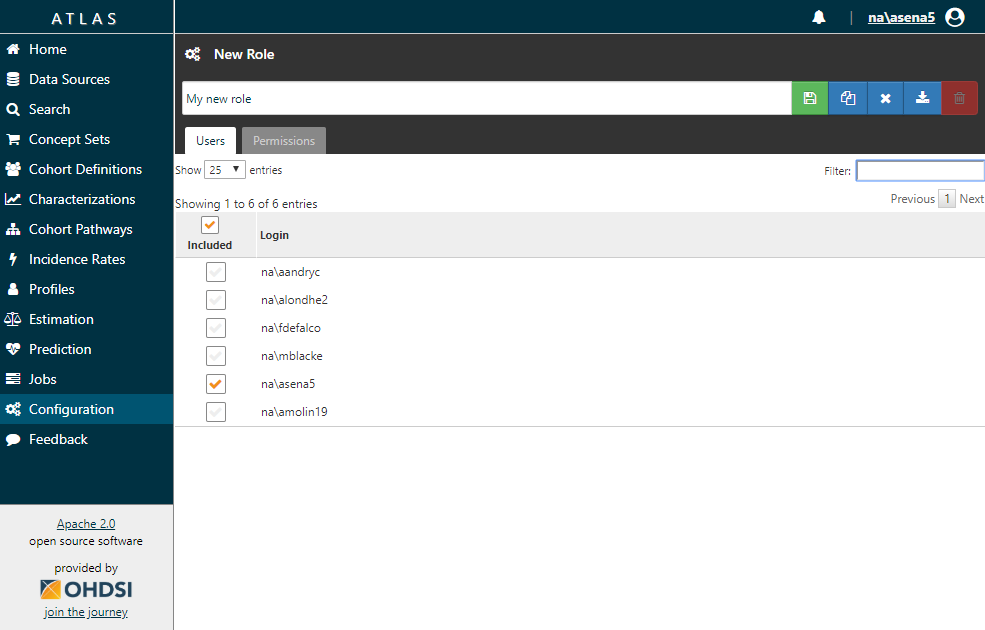
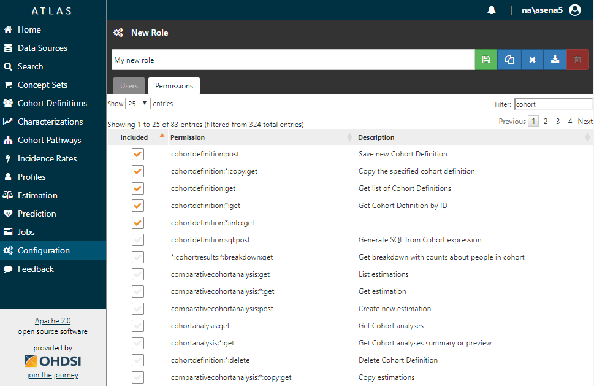
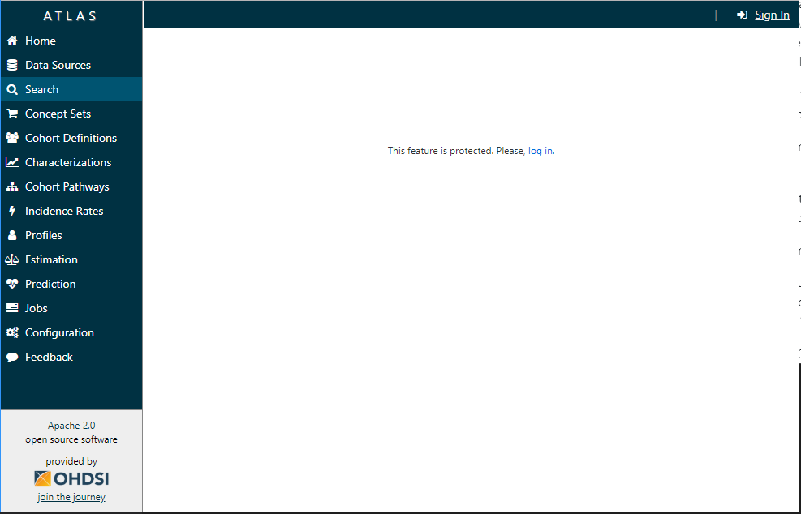
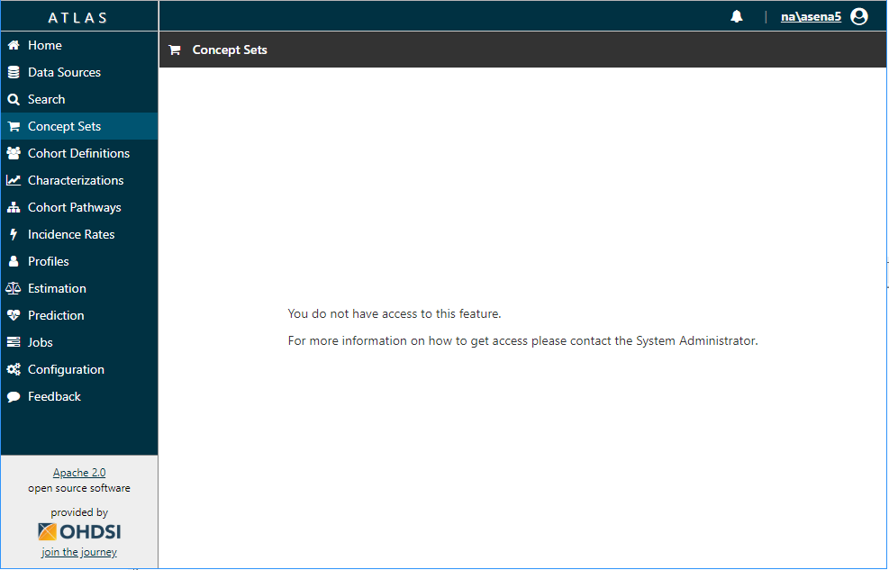

# ATLAS Security

The following sections discuss how WebAPI security is utilized in [ATLAS](https://github.com/OHDSI/Atlas).

## Configuring ATLAS

Now that we have the OHDSI WebAPI configured, we can now setup ATLAS to expect a secure OHDSI WebAPI.

Placing a `config-local.js` file inside the root `atlas/js` file in your web installation will allow you to override the configuration settings without requiring changes to the Github repository or accidentally pushing your local information to Github.  The following code configures ATLAS to expect a secure OHDSI WebAPI installation and configures it to use our newly created demonstration database.

```javascript
define([], function () {
	var configLocal = {};

	configLocal.userAuthenticationEnabled = true;

	configLocal.api = {
		name: 'Demo Environment',
		url: 'http://localhost:8080/WebAPI/'
	};

	configLocal.authProviders = [{
		"name": "Local Security Test DB",
		"url": "user/login/db",
		"ajax": true,
		"icon": "fa fa-database",
		"isUseCredentialsForm": true
	}];

	return configLocal;
});
```

In the example above, the `configLocal.userAuthenticationEnabled` setting is updated to **true** to enable security in [ATLAS](https://github.com/OHDSI/Atlas). The `configLocal.api` contains the name and URL to connect to our WebAPI instance. `configLocal.authProviders` is an array that enables the specification of 1 or more authentication providers. A full list of authentication providers is included in the ATLAS `/js/config/app.js` `appConfig.authProviders` section and the ones that are enabled in your environment should be included in the `configLocal.authProviders` list.

For those that followed the [[Basic Security Configuration]], the settings above will work. For those using OAuth/AD, please use the relevant configuration for your setup.

## Defining an Administrator
You should now be able to load ATLAS and find that you can login to the environment using the authentication provider configured in the previous step.  However, you will have limited permissions.  The following query will list the current permissions that all users have in the database:

```sql
select sec_user.id as user_id, login, sec_role.id as role_id, sec_role.name as role_name
from sec_user
join sec_user_role on sec_user.id = sec_user_role.user_id
join sec_role on sec_user_role.role_id = sec_role.id
```
To grant yourself administrator privileges, find your login and the corresponding `user_id`, and then run the following query:

```sql
insert into sec_user_role (user_id, role_id) values (1000,2)
```

**NOTE:** Substitute your `user_id` for `1000` in the query above.

Now by logging out and logging back in to ATLAS you should be granted administrative rights across the system.  You will then be able to manage other permissions from the `Manage permissions` section found in the configuration tab.

## Manage Roles And Permissions

Permissions are grouped into roles. Administrator can assign roles to a user. On the `Configuration` page you will find the `Manage Permissions` button. It opens `Roles` page.

Note that `Manage Permissions` button is only available for members of the `admin` role.



You may click on certain role to edit it or press `New Role` button to create new role.

Now you're on `Role` page. Select users which are participated in the role on `Users` tab.



To define permissions for role members, go to `Permissions` tab.



Note that users can’t create permissions - all necessary permissions are created automatically.

## Access to User Interface Elements

When a user attempts to access some sections of ATLAS or interact with certain buttons, this generates a call to WebAPI methods. Given that some WebAPI methods are protected and the user may not have appropriate permission an error would be generated. To prevent this ATLAS limits access to UI controls based on a user’s permissions.

If a user tries to access a protected section and without first being authenticated, the following screen will be shown



If a user is authenticated but doesn’t have the permissions required for the section, the following screen will be shown



Also some UI controls (such as buttons, checkboxes, etc.) are disabled if the user isn’t permitted to perform the corresponding action. For example, if user isn’t permitted to create cohort, the “New Cohort” button will be disabled.
