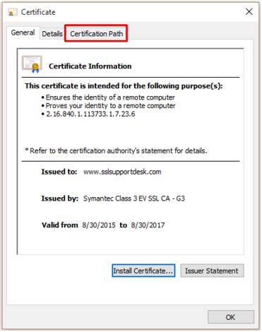
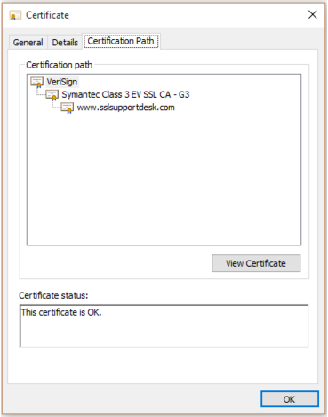
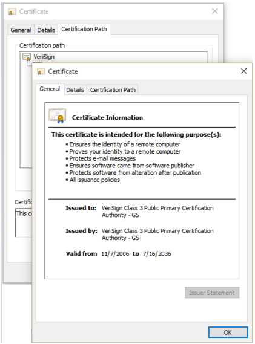
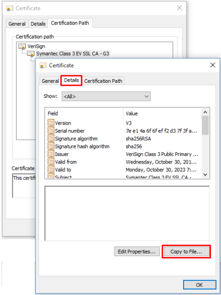
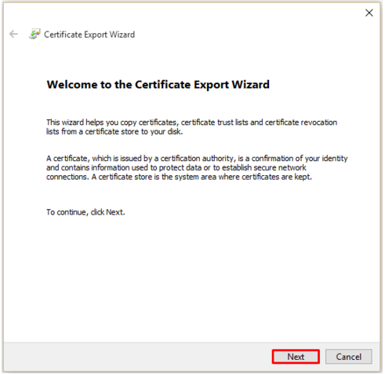
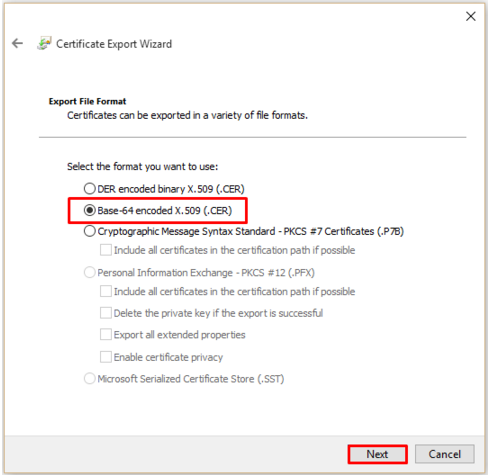
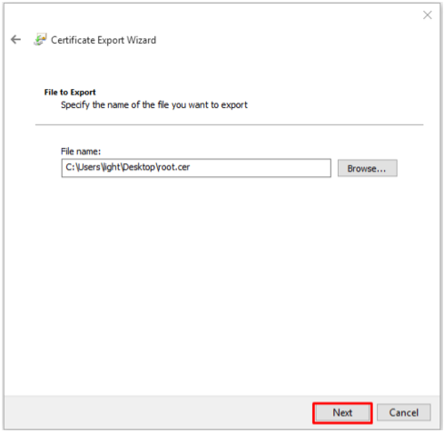
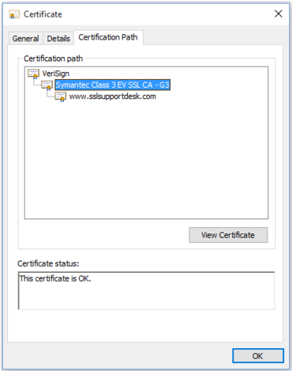
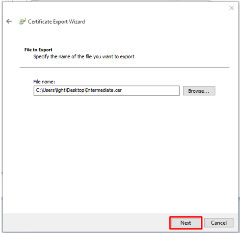

# SSL Configuration in Tomcat

First you will need to obtain and install a certificate. Here are steps to achieve this:

  * Generate a keystore using the `keytool` utility included with the Java JDK

```
  keytool -genkey -alias webapi -keyalg RSA -keystore C:\path\to\my\keystore.jks -keysize 2048
```

  * Generate CSR (Certificate Signing Request)
```
  keytool -certreq -alias webapi -keystore C:\path\to\my\keystore.jks -file C:\path\to\csr\webapi.csr
```

  * Now you need to follow instructions of CA (Certification Authority) of your choice to submit your CSR (for example VeriSign) to obtain the SSL certificate. Alternatively, you may opt to use [[OpenSSL]] to create a local CA for non-production use.

  * When you obtained certificate from CA, you need to import the CA’s root and intermediate certificates into a Java keystore file before you import the actual SSL certificate. The steps below outline this process for a Windows machine.

## Step 1: Retrieving your Root, Intermediate directly from your SSL certificate

  * Take your SSL certificate with a .cer extension. and double click on it.
  * At the certificate popup click on Certification Path.
  
  * Under Certification Path you will see a tier of three certificates.
    * Top certificate = Root
    * Middle certificate = Intermediate
    * Bottom certificate = SSL certificate for the common name it was issued to.
    *   

  * **Double click** on the **top certificate Root** in order to bring up its information.
  
  * Click **Details.**
  * Click **Copy to File...**
  
  * The Certificate Export Wizard will popup. Click **Next.**
  
  * Select **Base-64 encoded X.509 (.cer).**
  * Click **Next.**
  
  * On the next screen click **Browse** and specify the filename and path you want to save your Root certificate. Name it whatever you desire. **Example: Root.cer**
  * Click **Save.**
  * You will be taken back to the previous screen with the location and path of this file specified next to browse. **Click Next.**
  
  * Complete the export wizard by clicking **Finish**.

## Step 2: Retrieving your Intermediate CA directly from your SSL certificate (Continued)

*You will perform the same steps as above in step 1 but with the middle certificate (Intermediate).*

  * Go back to your SSL certificate under the **Certification Path** tab and **double click** on the Middle Certificate Intermediate in the tier.
  
  * Click Details.
  * Click Copy to File…
  
  * The Certificate Export Wizard will popup. **Click Next.**
  
  * Select **Base-64 encoded X.509 (.cer).**
  * Click **Next.**
  
  * On the next screen click Browse and specify the filename and path you want to save your Intermediate certificate. Name it whatever you desire. Example: Intermediate.cer
  * Click Save.
  * You will be taken back to the previous screen with the location and path of this file specified next to browse. Click Next.
  
  * Complete the export wizard by clicking Finish.

You should now have three files:
  - Your Root Certificate.
  - Your Intermediate Certificate.
  - Your SSL certificate where both the Root, and Intermediate are derived from.

## Step 3: Installing your Root CA, CA Intermediate, and your SSL certificate

Import the Root Certificate first.  You will specify your own alias for this import Example: Root.

```
  keytool -import -alias root -trustcacerts -file C:\path\to\root.cer -keystore C:\path\to\my\keystore.jks  
```

Import the Intermediate CA certificate second. You will specify your own alias for this import. Example: Intermediate. 

```
  keytool -import -alias intermediate -trustcacerts -file C:\path\to\intermediate.cer -keystore C:\path\to\my\keystore.jks
```

Lastly, import the actual SSL certificate into the keystore.

```
  keytool -importcert -trustcacerts -alias webapi -file C:\path\to\cert\webapi.p7b -keystore C:\path\to\my\keystore.jks
```

Now you can add SSL connector in Tomcat's `server.xml` file

```
  <Connector 
    port="8443" 
    protocol="org.apache.coyote.http11.Http11NioProtocol"
    maxThreads="200"
    scheme="https" 
    secure="true" 
    SSLEnabled="true"
    keyAlias="webapi"
    keystoreFile="C:\path\to\my\keystore.jks" 
    keystorePass="{Your keystore password}"
    clientAuth="false" 
    sslProtocol="TLS"/>
```

Apache Tomcat contains more details on [SSL Setup here](https://tomcat.apache.org/tomcat-8.5-doc/ssl-howto.html).

